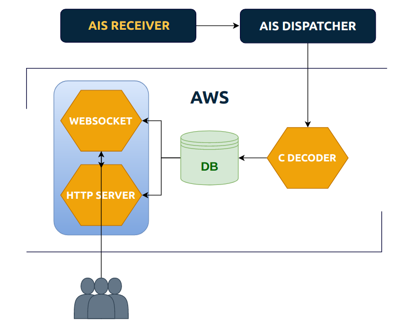

<h1 align="center">
	Vessel Screener
</h1>

<p align="center">
	<br>
	
</p>

> Vessel screener is an application that collects and shows navigation information (AIS) from vessels

### Development Setup

We are using `Python 3.8`, `Go 1.14.6` and `gcc > 9.2` with **Linux** & **OS X**

Clone with

```
git clone --recurse-submodules -j8 git@github.com:jussihyva/vessel_screener.git
```

Or just update submodules

```
git submodule update --init --recursive
```

#### Pipenv

Install pipenv

`pip install --user pipenv`

Install dependencies

`pipenv install`

Activate it

`pipenv shell`

Remove env

`pipenv --rm`

#### Run

Look [Makefile](/Makefile)

##### Scripts we have used

Fetch data from an external API

`/scripts/fetch.py <url> > realtime.log`

Seeding database with sample data and faking realtime data

`/scripts/seed_db.py`

### Created By
<!-- ALL-CONTRIBUTORS-LIST:START - Do not remove or modify this section -->
<!-- prettier-ignore-start -->
<!-- markdownlint-disable -->
<table>
  <tr>
    <td align="center"><a href="https://github.com/tuommii"><br /><sub><b>Miikka Tuominen</b></sub></a><br /><a href="https://github.com/jussihyva/vessel_screener/commits?author=tuommii" title="Code">Show commits</a></td>
    <td align="center"><a href="https://github.com/jussihyva"><br /><sub><b>Juhani Kauppi</b></sub></a><br /><a href="https://github.com/jussihyva/vessel_screener/commits?author=jussihyva" title="Code">Show commits</a></td>
  </tr>
</table>

<!-- markdownlint-enable -->
<!-- prettier-ignore-end -->
<!-- ALL-CONTRIBUTORS-LIST:END -->
